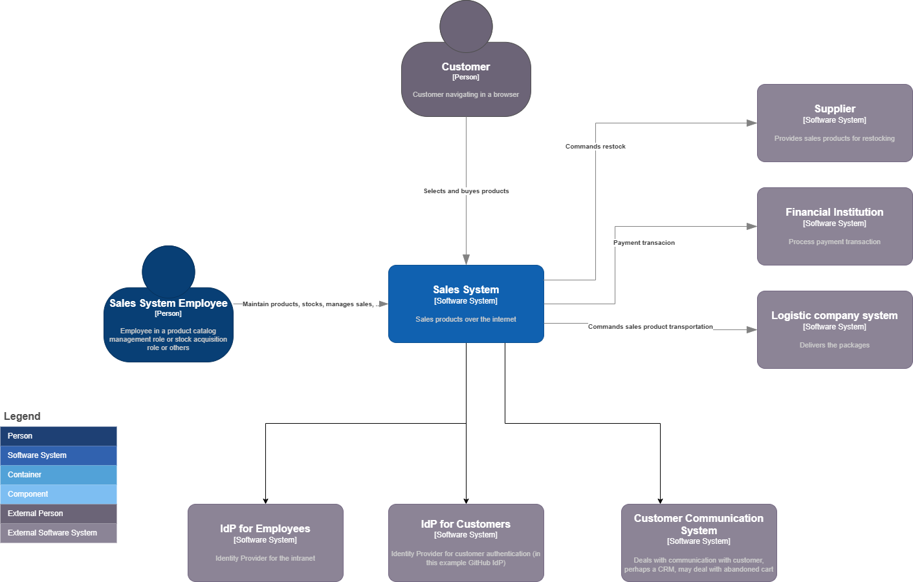
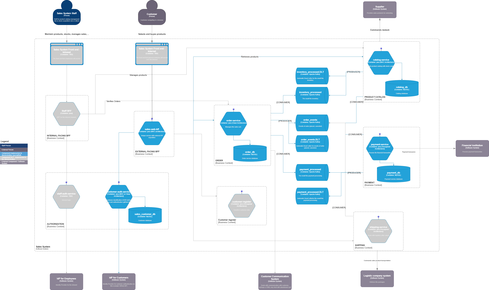

# Introduction
## Goal
I started my career as a developer and have spent the past 15 years working as an architect (Enterprise, Business, IT, and Solution Architect). As I plan my return to hands-on development—driven by the autonomy of the role and the flexibility to collaborate across different time zones — I refreshed my technical skills through specialized courses and built this demonstration project to put those concepts into practice.

By combining a strong architectural background with hands-on engineering, I bring a holistic view to software development, truly understanding the complete ecosystem.

This is a **portfolio program** designed to showcase proficiency in modern backend development and distributed systems using Java 21, Spring Boot 4, JPA, Kafka, Feign, MapStruct, OpenAPI/Swagger, and Docker.

The backend Sales System consists of 5 microservices and 2 infrastructure containers configured for demonstration. To showcase distributed transactions with **Kafka**, I intentionally designed topics with multiple subscribers to implement a **choreographed SAGA pattern**. Building this provided invaluable hands-on experience in handling event-driven choreography and compensation logic.

# About the development
## C4 - Level 1 (Context)
A high-level diagram illustrating the core Sales System and its external integrations.


## C4 - Level 2 (Containers)
Shows the microservices, databases, and messaging topics. The scope of this demo is filled in blue.



## Design patterns
To demonstrate versatility, **the microservices implement different architectural patterns**, including standard **MVC**, **Clean** Architecture, and **Hexagonal Architecture** (documented in C4 Level 2).

## Other Documentation Artifacts
* **Sequence diagrams**: [Sequence diagram](Documentation/C4_Sales_System-Sequence_diagram.drawio.png) shows component interactions across key flows.
* **Entity relationship diagrams (ERDs)**: [db-orders](Documentation/C4_Sales_System-db-orders.drawio.png), [db-catalog](Documentation/C4_Sales_System-db-catalog.drawio.png), [db-payment](Documentation/C4_Sales_System-db-payment.drawio.png), [db-customer-auth](Documentation/C4_Sales_System-db-customer-auth.drawio.png) (useful when connecting directly to databases via DBeaver or similar tools).
* **State machine**:  [State machine diagram](Documentation/C4_Sales_System-State_machine.drawio.png) shows cart and SAGA statuses.
* The swaggers - While only the BFF is intended for external exposure through an API Gateway in production, specs are provided for all services:
	* [bff](Documentation/swagger_bff.json) or at [swagger editor](https://editor.swagger.io/?url=https://raw.githubusercontent.com/mcyomura/DemoSalesSystemMcy/refs/heads/master/Documentation/swagger_bff.json)  
 	* [order](Documentation/swagger_order-service.json) or at [swagger editor](https://editor.swagger.io/?url=https://raw.githubusercontent.com/mcyomura/DemoSalesSystemMcy/refs/heads/master/Documentation/swagger_order-service.json)  
  	* [catalog](Documentation/swagger_catalog-service.json) or at [swagger editor](https://editor.swagger.io/?url=https://raw.githubusercontent.com/mcyomura/DemoSalesSystemMcy/refs/heads/master/Documentation/swagger_catalog-service.json)
  	* [customer-auth](Documentation/swagger_customer-auth-service.json) or at [swagger editor](https://editor.swagger.io/?url=https://raw.githubusercontent.com/mcyomura/DemoSalesSystemMcy/refs/heads/master/Documentation/swagger_customer-auth-service.json) 

# Services overview
## Microservices:
* **sales-web-bff (8085):** The only microservice intended to expose its endpoints externally via an API Gateway.
* **order-service (8082):** Manages the cart lifecycle (adding items, calculating totals, checking for stale prices, and processing checkout).
* **catalog-service (8081):** Owns product catalog and inventory/stock management.
* **payment-service(8083):** Mocks integration with a payment provider. It receives a payment token (typically generated client-side via a provider SDK), confirms transactions, and issues refunds when necessary. Note: In this demo, passing a payment token ending in 99 simulates a declined payment.
* **customer-auth-service (8084):** Handles authentication with an Identity Provider (IdP). For this demo, it **integrates with GitHub OAuth 2.0** to eliminate custom infra overhead and leverage existing developer accounts.

## Infrastructure containers:
* **kafka:** Message broker handling distributed event streaming.
* **MariaDB:** I started the local project with MySql, but migrated to MariaDB (lighter) in containers. Although a single database container is used, database schemas remain fully isolated using distinct database users (e.g., catalog-service connects strictly via appCatalogService user credentials).

## SAGA choreography:
Upon cart checkout, the workflow executes as follows:
* **Order-service publishes** an **ORDER-PLACED event** to the order_events topic.
* **Catalog-service consumes** the **ORDER-PLACED event** and deducts inventory/stock itens. It then sends a **SUCCESS event** on inventory_processed topic or a **FAILED event** if stock is insufficient for any product.
* **Payment-service** at the same time, **consumes ORDER-PLACED event** and "process" (mocked) the payment. It then emits a **SUCCESS event** on payment_processed topic or a **FAILED event** if payment fails.
* **Order-service listens for responses from both inventory_processed and payment_processed**:
	* If **both events were SUCCESS**, it then changes the **order status to APPROVED**.
   	* If payment/inventory published a FAILED event, then the order status changes to **CANCELED** and an **STOCK_DECLINED/PAYMENT_DECLINED event** or both is sent.
* Compensation handling:
	* If a **STOCK_DECLINED event** were raised, then payment-service will process a **refund** and publishes back (inventory-processed topic) a **REFUNDED** event to update order-service record.
	* If a **PAYMENT_DECLINED event** were raised, then catalog-service will process the **stock return** and publishes back (payment-processed topic) a **RETURNED** event to update order-service record.

Technical SAGA Considerations:
* **Optimistic Locking (@Version)**: To handle concurrent updates when both inventory and payment events arrive simultaneously, @Version is used. If two events read the state concurrently, the first commit succeeds while the second fails with an optimistic locking exception. **kafkaErrorConfig** intercepts this failure and retries, allowing the second event to succeed on its next attempt against the newly updated state.
* Event Ordering: To prevent cancellation or compensation events from executing BEFORE an ORDER-PLACED event, **all related messages** publish to the order_events topic **using the Order UUID as the partition key**. This guarantees strict, sequential processing per order.
    
## Usage of AI
AI is undeniably here to stay. However, since my primary goal with this project was to solidify my understanding of core concepts, I initially limited AI usage to clarifying doubts, brainstorming, and guiding the initial setup. Toward the end—specifically for automated testing and the final microservice—I experimented with AI-assisted coding. While it significantly boosts productivity, I concluded that developers must deeply understand the underlying code to effectively evaluate, correct, and steer AI-generated outputs.

## Dev vs Hom vs Prod environment
Dedicated dev and prod profiles (application.properties) were created to demonstrate configuration management best practices:
* Swagger/OpenAPI: Exposed exclusively under the dev profile.
* Price Expiration: Price staleness threshold is set to 10 minutes in dev versus 6 hours in prod
* Infrastructure Governance: In a real-world production setup, Kafka topics would be managed via Infrastructure as Code (IaC) rather than auto-creation. Infrastructure URLs, servers, and networks would also be strictly segmented across environments.
* Secrets Management & Key Rotation: In customer-auth-service, RSA key pairs would be securely managed using a vault. Key rotation (currently triggered via a local CRON) should be decoupled into an isolated scheduler (e.g., Control-M or a dedicated lightweight trigger service) to prevent race conditions when running multiple instances/pods.

# Running the demo  
> **Note on Authentication (v1.0.6+):** Starting from release **v1.0.6**, OAuth2 login via GitHub is required to execute authenticated operations. If you prefer to test the system without GitHub OAuth setup, please download [Release v1.0.5](https://github.com/mcyomura/DemoSalesSystemMcy/releases/tag/v1.0.5) and use its readme version.

## Prerequisites & Setup (v1.0.6+)  
1. **Tools**: Java 21, Docker Desktop, Docker compose, Github Account
2. **GitHub OAuth App Registration:**
   * Go to **GitHub Settings** > **Developer Settings** > **OAuth Apps** > **New OAuth App**.
   * Set **Authorization callback URL** to:
     `http://localhost:8085/api/v1/salesbff/auth2/callback`
   * Generate and copy your **Client ID** and **Client Secret**.
3. **Environment File Configuration:**
   * Rename the .env.example file to .env and fill in the Client ID and Client Secret generated in the last step
     
## Instructions to run
* Download the zip 
* I would build one service at a time:
	* docker compose build bff-service
	* docker compose build order-service
	* docker compose build catalog-service
	* docker compose build payment-service
	* docker compose build customer-auth-service
* Run the containers: docker compose up -d
* Wait 2-5 minutes for the services go up
* Open your browser and navigate to the GitHub authorization URL - replace YOUR_GITHUB_CLIENT_ID and YOUR_GITHUB_LOGIN_EMAIL: https://github.com/login/oauth/authorize?client_id=YOUR_GITHUB_CLIENT_ID&scope=read:user,user:YOUR_GITHUB_LOGIN_EMAIL
* After authorizing, GitHub redirects to your callback URL with a token like this:
```json
{"token":"A LONG TOKEN IN HERE","tokenType":"Bearer","email":null,"fullName":"xxxxxx"}
```
* Copy the token (the piece inside the quotation marks, i.e. without the quotation marks) and use it when **Authorization** is needed.
* Use postman to send the requests (see examples below)

## Postman examples (usage)
### Get paged list of products:
---
**Request:**  
**Method**: GET  
**URL**: http://localhost:8085/api/v1/salesbff/products (default page = 0, size = 10) or
http://localhost:8085/api/v1/salesbff/products?page=1&size=3 (paged)  

**Response:**
```json
{
    "content": [
        {
            "description": "Articulated monitor arm with desk clamp",
            "id": 10,
            "name": "Dual Monitor Mount",
            "price": 189.9,
            "quantityInStock": 37,
            "sku": "HOME-MONI-SUP-06",
            "supplierName": "Home & Comfort Data"
        },
        {
            "description": "Synthetic leather deskpad 90x40cm",
            "id": 11,
            "name": "Deskpad Keyboard Mat",
            "price": 45.0,
            "quantityInStock": 69,
            "sku": "HOME-DESK-PAD-07",
            "supplierName": "Home & Comfort Data"
        },
        {
            "description": "Whiteboard for notes 90x60cm",
            "id": 12,
            "name": "Magnetic Whiteboard",
            "price": 69.9,
            "quantityInStock": 110,
            "sku": "HOME-BRD-MAG-08",
            "supplierName": "Home & Comfort Data"
        }
    ],
    "page": {
        "size": 3,
        "number": 3,
        "totalElements": 52,
        "totalPages": 18
    }
}
```

### Get product details (valid products 1 to 52):
---
**Request:**  
**Method**: GET    
**URL**: http://localhost:8085/api/v1/salesbff/products/1  

**Response:**
```json
{
    "description": "Wireless mechanical keyboard with brown switches",
    "id": 1,
    "name": "Mechanical Keyboard RGB",
    "price": 89.99,
    "quantityInStock": 46,
    "sku": "TECH-KEYB-RGB-BR",
    "supplierName": "Tech Components Ltd"
}
```

### Add item to empty cart
---
**Request:**  
**Method**: POST  
**URL**: http://localhost:8085/api/v1/salesbff/cart/items  
**Body**: Select: Body - raw - JSON format and post:  
```json
{
   "productId": 1,
   "quantity": 3
}
```
**Response:**
```json
{
    "customerId": 751060,
    "items": [
        {
            "productId": 1,
            "quantity": 3,
            "unitaryPriceAtCart": 89.99
        }
    ],
    "pricesUpdated": false,
    "status": "DRAFT",
    "totalAmount": 269.97,
    "uuid": "8fd55170-a6af-46ca-b06d-f8bb7d6055df"
}
```

### Add item to existing cart
---
**Request:**  
**Method**: POST  
**URL**: http://localhost:8085/api/v1/salesbff/cart/items  
**Body**: Select: Body - raw - JSON format and post using the **"uuid" returned on previews call**  
```json
{
   "productId": 4,
   "quantity": 1,
   "uuid": "8fd55170-a6af-46ca-b06d-f8bb7d6055df"
}
```
**Response:**  
```json
{
    "customerId": 252301,
    "items": [
        {
            "productId": 1,
            "quantity": 3,
            "unitaryPriceAtCart": 89.99
        },
        {
            "productId": 4,
            "quantity": 1,
            "unitaryPriceAtCart": 29.90
        }
    ],
    "pricesUpdated": false,
    "status": "DRAFT",
    "totalAmount": 299.87,
    "uuid": "8fd55170-a6af-46ca-b06d-f8bb7d6055df"
}
```

### Proceed to cart checkout
---
**Request:**  
**Method**: POST  
**URL**: http://localhost:8085/api/v1/salesbff/cart/checkout  
**Authorization**: Select type = bearer token, post the code obtained at login without the **" "**.  
**Body**: Body - raw - JSON format and post using the **"uuid" returned on previews call**. If you want a declined payment, make the paymentToken ending with "99"  
```json
{
   "uuid": "8fd55170-a6af-46ca-b06d-f8bb7d6055df",
   "paymentToken": "fioeJIEFHD"
}
```
**Response:** 
```json
{
    "id": 5,
    "customerId": 791832,
    "status": "PENDING",
    "inventory_status": "PENDING",
    "payment_status": "PENDING",
    "totalAmount": 299.87
}
```


### Check cart status 
---
**Request:**  
**Method**: GET  
**URL**: http://localhost:8085/api/v1/salesbff/cart/5  (use as parameter the **"id" returned during checkout**)   
**Authorization**: Select type = bearer token, post the code obtained at login without the **" "**.  

**Response:** 
```json
{
    "id": 5,
    "customerId": 791832,
    "status": "APPROVED",
    "inventory_status": "SUCCESS",
    "payment_status": "SUCCESS",
    "totalAmount": 299.87
}
```
